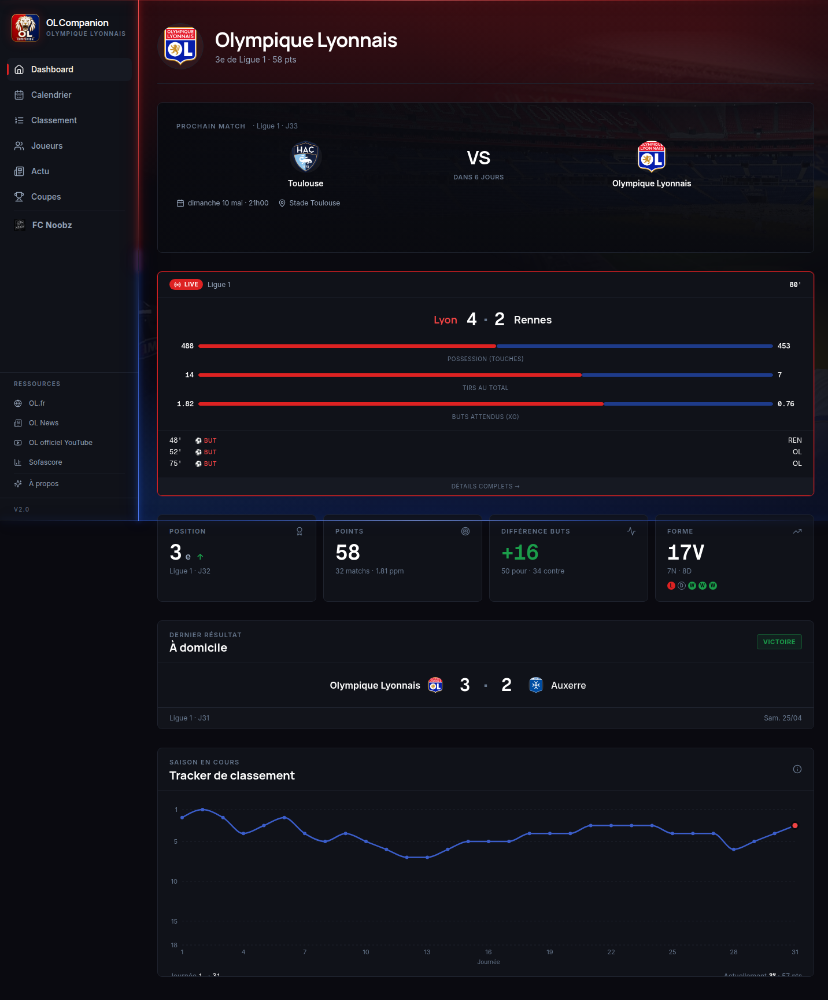
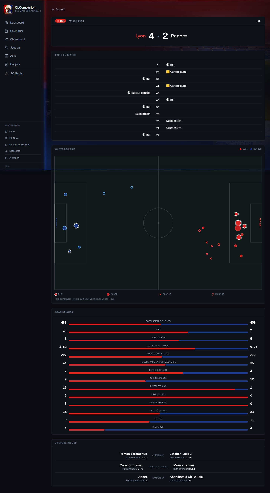
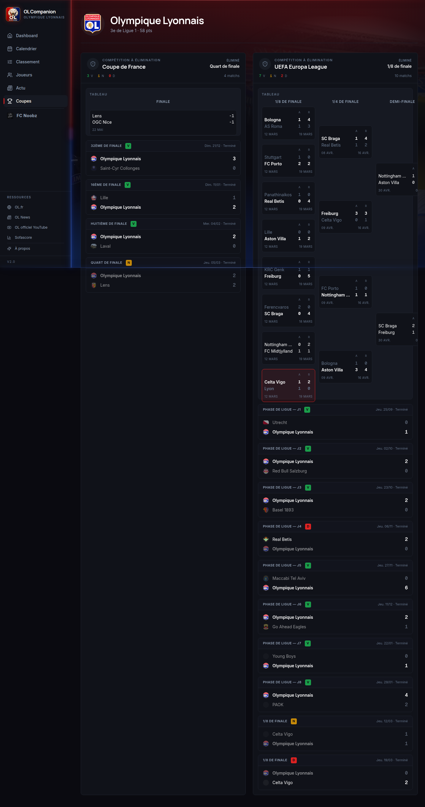
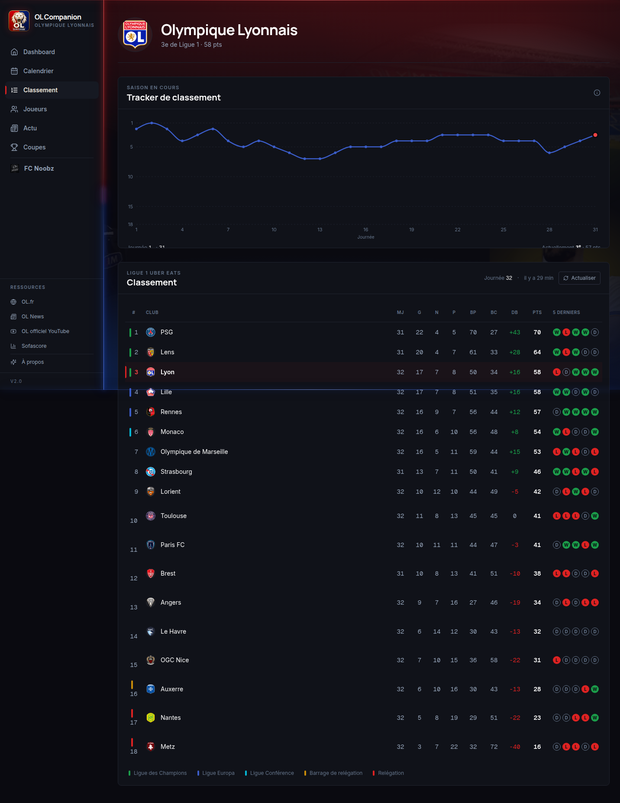
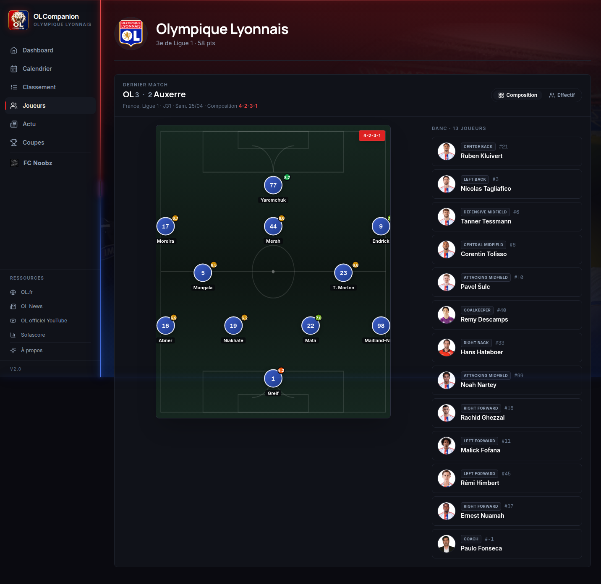
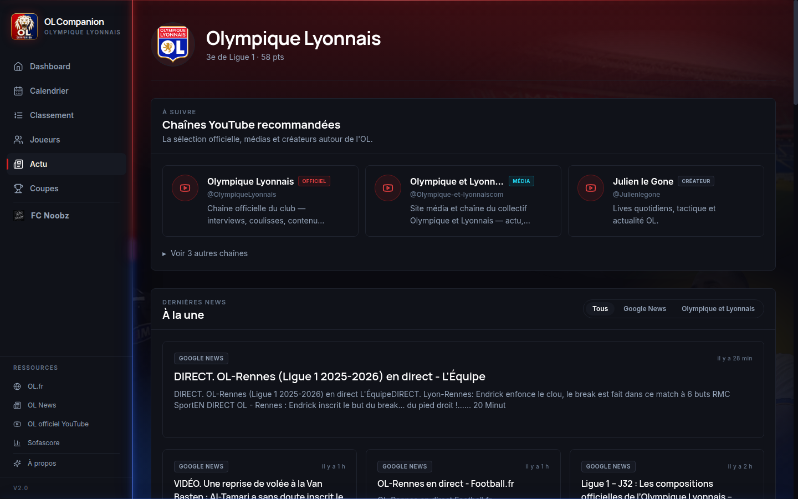

# OL Companion

> Compagnon perso pour suivre l'Olympique Lyonnais : live match, calendrier, classement Ligue 1 (avec règles LFP de départage), effectif, news, coupes (avec bracket). Plus une section privée FC Noobz pour suivre l'équipe loisirs entre amis.



> Dashboard pendant un match : carte live (statut, score, possession, tirs, xG, derniers events) + tracker de classement saison. Mis à jour en push via SSE quand quelque chose bouge côté 365scores.

## Pourquoi

Dev Java/web depuis 2005, je voulais explorer [Claude Code](https://claude.com/claude-code) sur un stack moderne (**React 18 + Vite + Tailwind + shadcn**) avec un sujet vraiment perso : suivre l'OL au jour le jour, sans dépendre d'apps mainstream qui pollue d'ads ou imposent un parcours.

L'identité visuelle reprend les **codes du club** (rouge + bleu lyonnais) avec une mise en scène inspirée d'un néon "Olympique Lyonnais" qui éclaire le fond de page. Référence design : Sofascore, Football Manager, Linear.

En amont du code, [ChatGPT](https://chat.openai.com) a aidé à générer le **logo OL Companion** et les premières maquettes UX qui ont guidé la construction.

## Fonctionnalités

- **Dashboard** — prochain match, dernier résultat, position au classement
- **Live match** — quand l'OL joue (ou vient de jouer) : carte sur l'accueil + page dédiée `/match/:gameId` avec timeline (buts, cartons, subs), shot map (xG par tir + outcome), 14 stats agrégées par équipe avec barres comparatives, top performers par rôle. Updates via **SSE push** (cron 30 s qui diffe la signature et émet un event si quelque chose change).
- **Classement Ligue 1** avec règles LFP (différence générale, buts marqués, etc.) — données 365scores
- **Trajectoire saison** : tracker de position (chart Recharts, line OL bleu + dot OL rouge sur la journée courante)
- **Calendrier** — fixtures passés + à venir avec adversaires, scores, compositions
- **Effectif** — composition (formation field SVG dynamique) + liste des joueurs avec photos 365scores CDN
- **Coupes** — Coupe de France + Coupes d'Europe le cas échéant. **Bracket schématique** affiché à partir des 1/4 (CdF) ou 1/8 (EL), avec confrontations aller/retour groupées et équipe qualifiée en gras.
- **News** — agrégat RSS multi-sources (OL officiel, Olympique-et-Lyonnais, L'Équipe, Google News)
- **YouTube** — chaînes lore/club recommandées
- **FC Noobz** — section privée perso (équipe loisirs entre amis)
- **Reset saison automatique** — cron annuel le 1er août archive les caches dans `data/archive/<season>/` et redémarre la collecte. Endpoint admin `POST /api/admin/reset-season` pour le forcer manuellement.

## Captures

### Page match — timeline + shot map + stats équipe + top performers



Tous les blocs viennent **du même endpoint 365scores** (`/web/game/?gameId=X&matchupId=H-A-G`) — les stats équipe sont reconstruites côté backend en agrégeant les stats de chaque titulaire, et le shot chart utilise la convention de coordonnées (`side` = axe long, `line` = axe court) avec marqueurs proportionnels à √xG.

### Coupes — bracket aller/retour avec confrontations groupées



Le bracket apparaît dès les **1/4 de finale** (Coupe de France) ou les **1/8** (Europa League). Pour les coupes européennes, les deux manches d'une confrontation sont fusionnées dans une seule carte avec colonnes `A` (aller) et `R` (retour) et l'équipe qualifiée en gras. La confrontation impliquant l'OL est highlightée en rouge.

### Classement Ligue 1 — règles LFP



Différence de buts, buts marqués, départage selon les règles LFP (et pas l'ordre d'appel football-data qui ignore le tie-break). Bandes colorées sur la gauche pour la qualification européenne / barrage / relégation.

### Effectif — formation + banc



SVG dynamique du terrain avec position de chaque titulaire selon la formation 365scores, photos joueurs depuis le CDN 365scores (pas Wikipedia, plus fiable pour les noms ambigus), banc à droite avec poste + numéro.

### News multi-sources



Agrégat RSS de 3 sources (OL officiel via olympique-et-lyonnais.com, L'Équipe filtré par mots-clés OL, Google News). Décodage HTML double pour Google News qui encode parfois ses descriptions deux fois.

## Stack

| Couche | Tech |
|---|---|
| Frontend | React 18 + TypeScript 5 + Vite 5 + Tailwind 3 + TanStack Router/Query + Recharts + Lucide |
| Backend | NestJS 11 + TypeScript 5 + `@nestjs/schedule` v5 (cron) + Anthropic SDK |
| Live updates | SSE (`@nestjs/common` `@Sse` + `EventSource` côté client + `invalidateQueries` TanStack) |
| Storage | JSON cache local (TTL 1h sur fixtures, 5 s en live, archive auto par saison) |
| Sources externes | [365scores](https://www.365scores.com/) (classement, live stats, shot map, lineups), [football-data.org](https://www.football-data.org/) (free tier, fixtures), Wikipedia FR (logos) |
| Build | Docker multi-stage (node:20-alpine → nginx:alpine) |
| Déploiement | docker-compose (testé Synology NAS DSM) |

## Setup local

### Prérequis
- Docker 24+
- Une clé [football-data.org](https://www.football-data.org/client/register) (free tier suffit pour Ligue 1)
- Optionnel : clé Anthropic pour les enrichissements lore/résumés

### Lancement
```bash
git clone <ce-repo> ol-companion
cd ol-companion

cp backend/.env.example backend/.env
# Édite FOOTBALL_API_KEY (obligatoire) + ANTHROPIC_API_KEY (optionnel)

mkdir -p data
docker compose up -d --build
```

Frontend disponible sur `http://localhost:4202`.
Backend API sur `http://localhost:3002/api/health`.

Les caches API (fixtures, standings, etc.) se peuplent au premier appel.

## Identité visuelle

- **Palette** : rouge (HSL 0 73% 50%) + bleu OL (HSL 224 64% 33%) + or discret pour les accents nobles
- **Néon** : `body::before/::after` lignes lumineuses haut/bas (rouge/bleu)
- **Fonts** : Inter / Manrope (display) / Geist Mono (chiffres tabular)
- **Règle stricte** : pas de vert sauf sémantique universelle (W/victoire/+goals/LdC). Le décoratif reste rouge ou bleu OL.

## Notes

- **API 365scores non officielle** — ce projet appelle les endpoints web de 365scores avec des headers réalistes. Ils peuvent changer de structure ou bloquer du jour au lendemain. Si tu forks pour un autre club, regarde `backend/src/modules/standings/`, `live-match/`, `cups/bracket.service.ts`, `lineup/` pour le pattern (User-Agent + headers + parsing).
- **football-data.org** : API publique avec free tier (10 req/min, suffit pour Ligue 1).
- **Anthropic SDK** : optionnel, sert pour quelques résumés. Sans clé, l'app fonctionne et masque proprement les sections concernées.
- **Reverse-engineering raisonnable** : un seul utilisateur, polling 30 s max sur les matchs live, 1 h sur le classement. Pas de proxy commercial, pas de scraping massif.
- Le module wiki-image est porté du projet warhammer40k (FR cette fois).

## Crédits IA

- **[Claude Code](https://claude.com/claude-code)** (Anthropic) — code frontend, backend, infra Docker
- **[ChatGPT](https://chat.openai.com)** (OpenAI) — logo OL Companion, premières maquettes UX, propositions de design

Inspirations design : [Sofascore](https://www.sofascore.com/), Football Manager 2024, [Linear](https://linear.app).
Principes UX : [refactoringui.com](https://refactoringui.com/), [lawsofux.com](https://lawsofux.com/).

OL ❤️

## Licence

MIT pour le code. Les marques OL, 365scores, football-data appartiennent à leurs ayants-droit respectifs.

---

**Si tu veux faire pareil** — prends un sujet qui t'enflamme, ouvre Claude Code, décris en langage naturel ce que tu rêves de voir exister, puis itère. Tu seras surpris de ce qu'on peut bâtir en quelques sessions.
